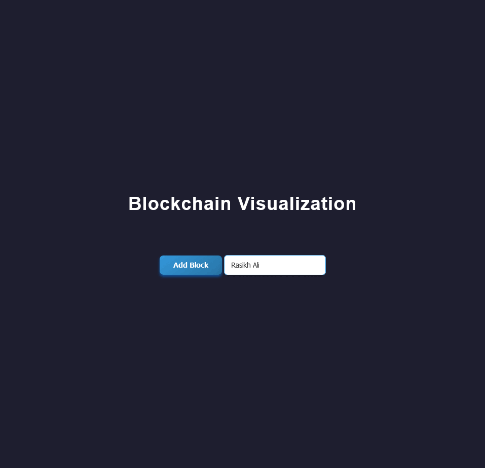

# Blockchain Visualization

 <!-- Add your image or GIF path here -->

## Description

This project is a dynamic blockchain visualization application built with Flask and Socket.IO. It allows users to add and remove blocks dynamically, providing a visual representation of the blockchain in real-time.

### Features

- **Dynamic Blockchain**: Add and remove blocks with real-time updates.
- **Interactive UI**: Engaging user interface with smooth animations.
- **WebSocket Integration**: Uses Socket.IO for real-time communication between the server and clients.

## Technologies Used

- **Backend**: Flask, Flask-SocketIO
- **Frontend**: HTML, CSS, JavaScript
- **Package Manager**: pip (for Python dependencies)

## Getting Started

### Prerequisites

Make sure you have Python and pip installed on your machine. You can check if they are installed with the following commands:

```bash
python --version
pip --version
```

### Installation

1. **Clone the repository**:

    ```bash
    git clone https://github.com/yourusername/blockchain-visualization.git
    cd blockchain-visualization
    ```

2. **Create a virtual environment** (optional but recommended):

    ```bash
    python -m venv venv
    source venv/bin/activate  # On Windows use `venv\Scripts\activate`
    ```

3. **Install dependencies**:

    ```bash
    pip install Flask flask-socketio
    ```

### Running the Application

1. Start the Flask server:

    ```bash
    python app.py
    ```

2. Open your web browser and navigate to `http://127.0.0.1:5000/`.

## Usage

- **Add a Block**: Enter data in the input field and click the "Add Block" button. A new block will be added to the blockchain.
- **Remove a Block**: Click the "x" button on any block to remove it from the blockchain.

## Contribution

Contributions are welcome! Please feel free to submit a pull request or open an issue if you find a bug or have a feature request.

## License
This project is for educational purposes only. Feel free to use and modify it as needed.
